This is a [Next.js](https://nextjs.org) project bootstrapped with [`create-next-app`](https://nextjs.org/docs/app/api-reference/cli/create-next-app).

## Getting Started

First, run the storybook:

```bash
npm run storybook
# or
yarn storybook
# or
pnpm storybook
# or
bun storybook
```


## Components

Input, Sidebar, Toast

## Input

Component has few props:
variants: "password" | "text" | "email" | "number"
label: text label for input
clearable: this prop is render button "x" for reset input
error: this prop have any styles for UI
value: value for input
onChange: function for value
disbled: disble input

## variant "text" with prop clearable
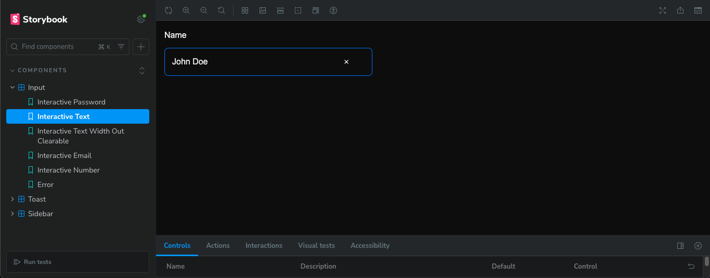
## variant "text" without prop clearable
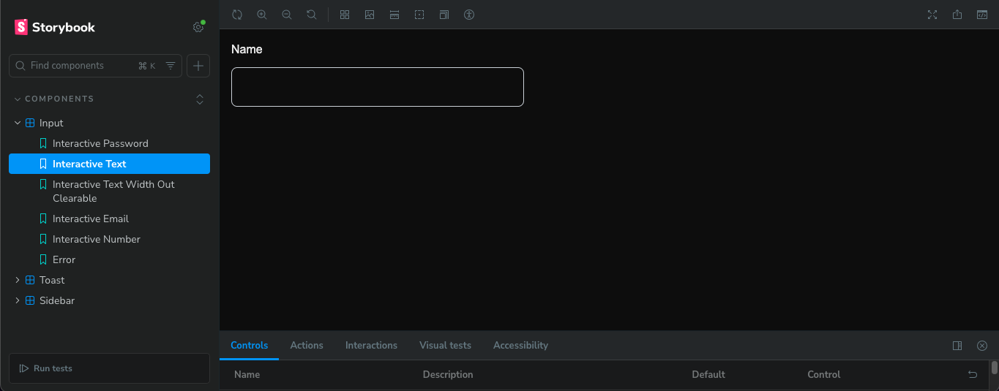
## variant "number"
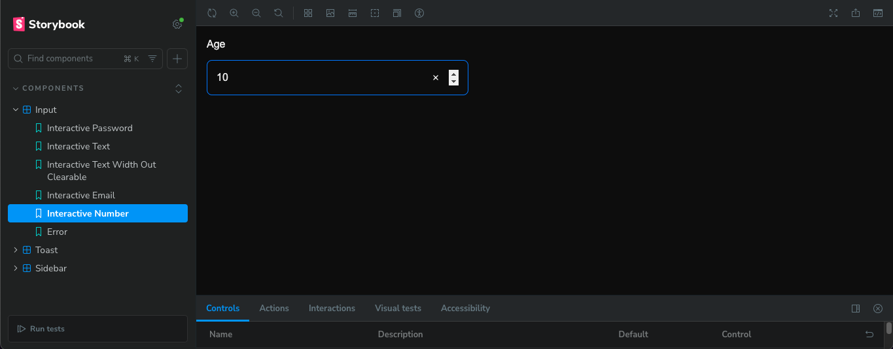
## variant "email"
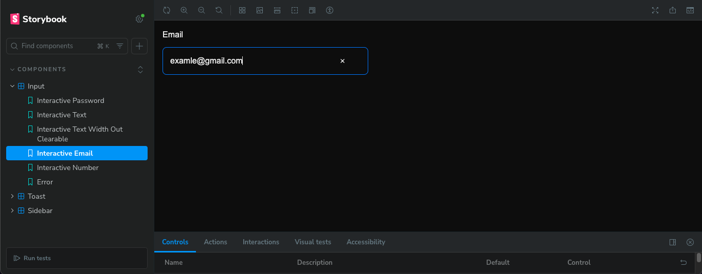
## variant "password" is not visible value
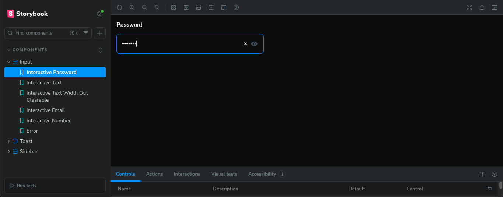
## variant "password" is visible value
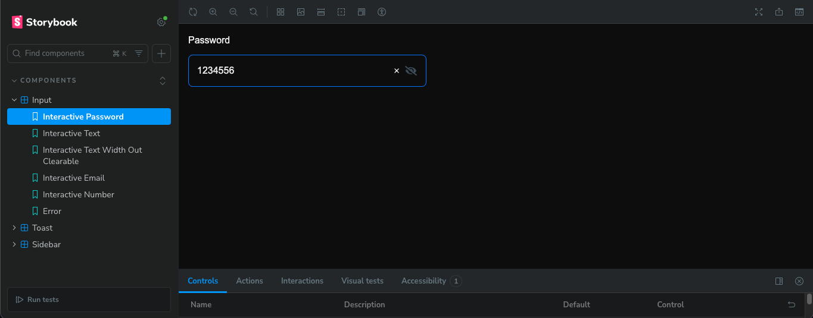
## variant "error"
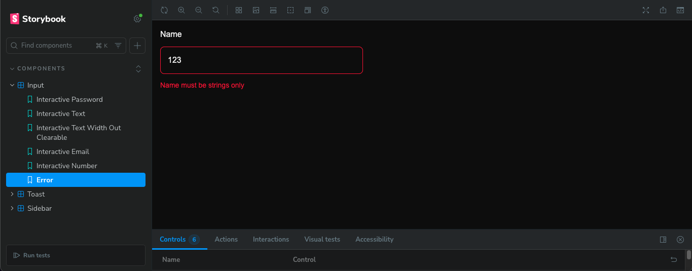

## Toast
Toast have 4 variants: error, info, wraning, success. Component toast have props: type: "success" | "error" | "info" | "wraning", message: your message, duration: how many live render component, closable: render button close component, onClose function close

## toast "error"
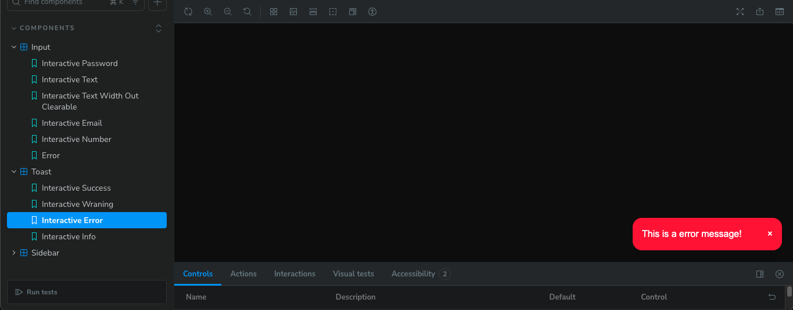
## toast "success"
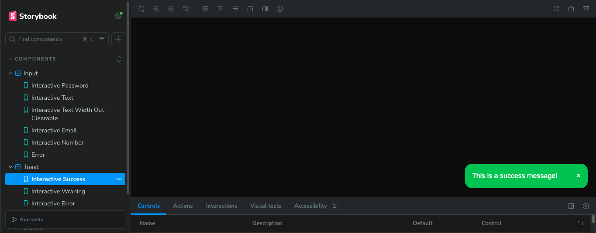
## toast "info"
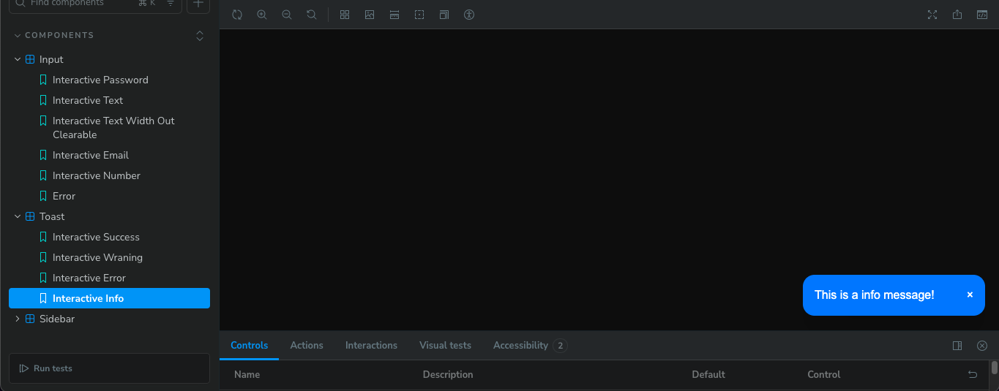
## toast "wraning"
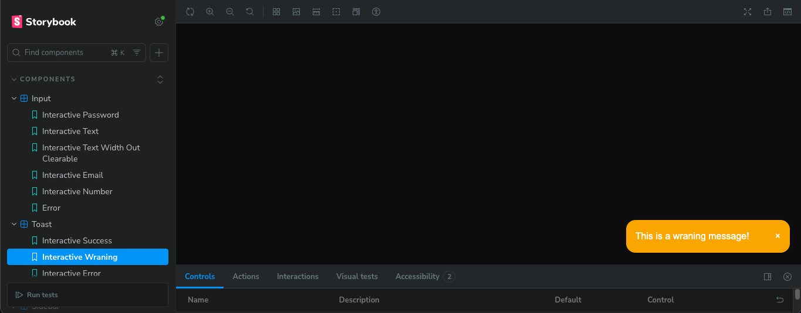
